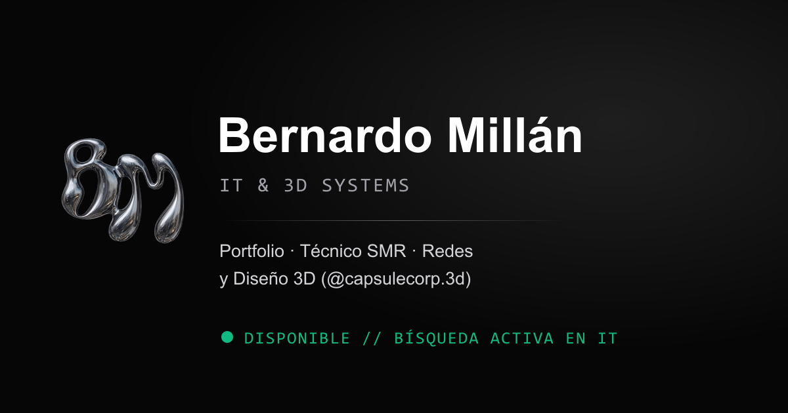

# Bernardo Millán · Portfolio — IT & 3D Systems



Web personal hecha con **Astro** (estática, sin backend): perfil, trayectoria, proyectos de
diseño/impresión 3D y formulario de contacto.

**En vivo:** <https://bernardomillan.is-a.dev> · mientras tanto <https://bernarmillan.github.io/>

## Stack

- **[Astro 7](https://astro.build)** + **Tailwind CSS 4** (dentro de Vite, sin config aparte)
- HTML + CSS + JS **inline**: 0 hojas de estilo externas, 0 `<script src>`, 0 dominios de terceros
- Fuentes **auto-alojadas** (Syne, Space Grotesk, JetBrains Mono — subconjunto latino con `preload`)
- Fotos `.webp` optimizadas + placeholder LQIP embebido en base64
- Contacto vía [FormSubmit](https://formsubmit.co) con envío AJAX («✓ Mensaje enviado» sin salir de la web)

## Comandos

| Comando | Qué hace |
| --- | --- |
| `npm install` | instala dependencias |
| `npm run dev` | servidor de desarrollo en `localhost:4321` (`--host` para la red local) |
| `npm run build` | build estático → `dist/` |
| `npm run check` | **37 comprobaciones** sobre `dist/` (tamaño, sin externos, reveal, SEO…) — sale con `1` si algo falla |
| `npm run preview` | sirve `dist/` en local |
| `npm run fonts` | regenera los subconjuntos de fuentes en `public/fonts/` |
| `npm run images` | reoptimiza las fotos a `.webp` |
| `npm run icons` | regenera favicons e iconos desde `media/logo.png` |
| `npm run og` | regenera `public/images/og.png` (1200×630, preview de WhatsApp/LinkedIn/Twitter) |

## Estructura

```text
/
├── public/            # assets servidos tal cual (fonts, images, projects, cv.pdf, robots, sitemap)
├── src/
│   ├── components/    # Navbar, Hero, CapsuleCorp3D, Contact, Footer…
│   ├── layouts/       # Layout.astro (head, SEO, reveal, reglas táctiles)
│   ├── pages/         # index.astro + 404.astro
│   └── data/          # portfolio.ts (contenido) y lqip.ts (placeholders)
├── scripts/           # check-dist.mjs, make-icons.mjs, make-og.mjs, copy-fonts…
└── .github/workflows/ # deploy a GitHub Pages con quality gate
```

## Despliegue

GitHub Actions (`.github/workflows/deploy.yml`): en cada *push* a `main` ejecuta
`npm ci` → `npm run build` → **`npm run check`** → publica `dist/` en **GitHub Pages**.
Si un check falla, **no se despliega**.

## Rendimiento y accesibilidad

- HTML ≈ 98 KB con todo inline; la carga de la página son ~0,58 MB (sin contar `cv.pdf`,
  que solo baja al pulsar el botón).
- **Reglas para táctil** (`pointer: coarse`): `backdrop-filter` desactivado, fotos en color,
  animaciones de entrada ligeras, `animate-ping`/`animate-pulse` apagados (salvo el flotado
  del avatar), *hover* de iOS neutralizado.
- *Fade* de carga escalonado (PC 10 px/1 s · táctil 5 px/0,6 s, curva *ease-out-sine*) con
  red de seguridad a los 2,5 s si el JS no llega a ejecutarse.
- Respeta `prefers-reduced-motion`.
- Comprobaciones automáticas: `npm run check` (37) — es la puerta de salida del deploy.

## Licencia

Código del portfolio: uso personal. Los recursos gráficos (logo, fotos, renders 3D) son
propiedad de su autor.
